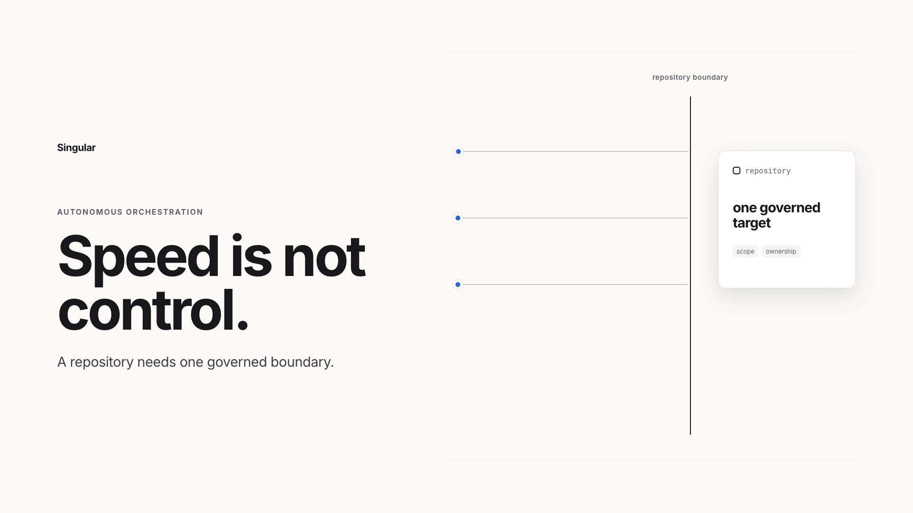

# singular

**Autonomous multi-agent orchestration for software repos. One engine, many consumers.**

singular is a bash + Python orchestration engine that drives autonomous AI coding agents
in parallel against a repository. It implements a three-tier scheduling model
(L0 origin loop → L1 area planners → L2 worker agents) with durable leases, state packets,
gate/audit pipelines, and git-worktree isolation. The engine is installed once per machine
and pinned per consumer repo — improvements propagate by bumping a version pin, not by
re-copying scripts.

## Video overview

[](docs/assets/singular-orchestration.mp4)

*Click the frame to play the 60-second overview (with sound) in GitHub's player.*

The video shows the orchestration loop from source intent through planning, isolated
worker execution, state packets, review, retry continuity, and integration.

## How it works

### Agent tiers

| Tier | Role |
| --- | --- |
| **L0 origin** | The single scheduler. Runs the reconcile cycle: import → recover → integrate → dispatch → snapshot. Holds the origin lock only during control work. |
| **L1 area planners** | One planner per DAG node (area). Reads the node's context, plans a batch of L2 tasks, and stages them as proposals for L0 to import. |
| **L2 workers** | Execute a single task in an isolated git worktree on a per-task branch. Produce a state packet (owned files, changes, evidence). An auditor reviews the packet; the decider routes the outcome. |

### Reconcile cycle

Each `singular reconcile --actuate` runs:

1. **Import** — pull staged L1 task proposals into the DAG under the origin lock.
2. **Recover** — reclaim stale leases whose workers have exited or timed out.
3. **Integrate** — merge completed worker branches into the target branch under the git-op lock.
4. **Dispatch** — pre-lease frontier tasks and spawn L2 workers.
5. **Snapshot** — write a human-readable project state snapshot.

### Leases and packets

Every in-flight task holds a **lease** (a JSON file in `.singular-state/leases/`) that records
ownership, retry count, and expiry. When a worker finishes it writes a **state packet**
(`state-packet.v0.schema.json`) enumerating owned files, changed files, commands, tests, and
evidence. The auditor validates the packet; the reaper attributes outcomes on later cycles.

### Gates and audits

After each L2 worker run the host executes the configured **gate command** (e.g. `npm test`).
A gate result (`gate-result.v0.schema.json`) feeds the **auditor** model, which returns an
audit verdict (`audit-verdict.v0.schema.json`). The **decider** maps the
`(failure-class, retries-left)` pair to a recovery action — retry, amend-scope, escalate, or
park — using a deterministic fast-path table before falling back to a model round-trip.

A bare command works: exit 0 passes, non-zero fails. The exit code cannot answer
two questions the engine would use if it could, so a gate may optionally write a
**gate observation** (`gate-observation.v0.schema.json`) to the path in
`SINGULAR_GATE_REPORT_FILE`:

- `failures[].signature` — stable per-failure identifiers. Required for
  `singular gate baseline` to tell an acknowledged failure from a new one.
- `infrastructureFailure` / `infrastructureReason` — the gate could not **run**
  (missing dependencies, full disk, unreachable network). The engine reports
  that as `inconclusive-infrastructure` instead of spending a task's retry
  budget asking a model to fix code that was never broken.

`singular init` scaffolds `docs/orchestration/gates/gate.sh` as a starting point.
The sidecar is never required — including on `schemaVersion: v2`. Without one
the engine falls back to the exit code plus a deliberately narrow set of log
signatures (`engine/infra-patterns.tsv`) covering only environment failures that
application code cannot plausibly produce.

## Dispatch model

**Detached dispatch is ON by default.** When `SINGULAR_DETACHED_DISPATCH=1` (the default),
`reconcile` pre-leases each frontier task and spawns the worker in its own session via
`dispatch-wrap.sh`, then returns within seconds. The origin lock is held only for the cycle's
control work. A **reaper** (`singular_reap_dispatches`) runs at the top of every
apply/actuate cycle and attributes completions, failures, and crashes by checking dispatch
records + worker exit files (pid liveness defeats pid reuse; crash detection drops from the
60-min stale-lease window to ~one cycle).

This is what keeps import, integrate, recover, STATUS, and STOP responsive while long
workers run in the background.

Set `SINGULAR_DETACHED_DISPATCH=0` to restore the legacy synchronous batch path, where
`reconcile` waits for every worker before returning.

## Install

Prerequisites:

- Bash >= 4, `python3`, and `git`.
- At least one supported runner CLI on `PATH` (`claude`, `codex`, or another
  configured runner).
- macOS users may need `brew install bash`. Set
  `SINGULAR_BASH_BIN=/opt/homebrew/bin/bash` in the shell/service environment to
  select it without reordering `PATH`.
- When multiple Codex installations exist, set
  `SINGULAR_CODEX_BIN=/absolute/path/to/codex`. Doctor and the runner use that
  exact executable and do not fall back when it is broken.

```bash
# Clone and install the engine to ~/.singular
git clone https://github.com/alex-reysa/singular-lite /path/to/singular-lite
cd /path/to/singular-lite
bash install.sh
# -> ~/.singular/versions/<ver>/  ~/.singular/current  ~/.singular/bin/singular

export PATH="$HOME/.singular/bin:$PATH"
```

Singular's launch namespace is intentionally clean: `SINGULAR_*`,
`singular.config.json`, `.singular-version`, `.singular-state/`, and the
`SINGULAR_HOME` install root (default `~/.singular`). It does not discover or
import the pre-launch namespace replaced by this release. Start each consumer
with `singular setup` and author a fresh DAG.

In each consumer repo:

```bash
singular setup     # one idempotent path from "a repo" to a verified, STOPPED repo
```

`singular setup` composes the individual lifecycle verbs and contributes the
order, the evidence, and the contract. It checks interpreter/repo/git work tree,
resolves the engine pin (naming the winner when `.singular-version` and
`singular.config.json` `engineVersion` disagree), installs the pinned engine when
it is absent — only from a matching engine checkout already on this machine,
since there is no download mechanism — writes `.singular-state/STOP` as its first
repo write, pins and scaffolds, hashes every gate result before printing and
running the migration chain, verifies those historical verdicts survived, runs
doctor, and records a supervised regression run. Prerequisites fail before
anything is mutated. It reports a state ladder
(`installed → migrated → validated → stopped-ready`), never actuates, and prints
exactly one `Next:` line. Failures carry a stable code and one recovery
instruction (`singular.operator-failure.v0`); evidence lands under
`.singular-state/setup/`.

```bash
singular setup --no-test      # stop at `validated`, without the regression run
singular setup --test-async   # start the suite detached; attach with singular test --wait
singular setup --json         # one singular.setup-report.v0 object on stdout
```

The composed steps are still available on their own:

```bash
singular init      # scaffold singular.config.json, docs/orchestration/, .singular-version
singular doctor    # check deps, engine resolution, repo config
singular migrate   # raise schemaVersion to the engine's (--dry-run prints the chain only)
```

`SINGULAR_BASH_BIN` is bootstrap-only and is ignored in `singular.config.json`;
set it before invoking `singular`. `SINGULAR_CODEX_BIN` may be supplied through
the normal engine environment/config layers. For the standard Codex runner,
`singular doctor` performs bounded `--version` and `login status` probes against
the exact selected executable.

Doctor is also the machine-readable preflight for unattended runs:

```bash
singular doctor --json | jq '.summary, .checks[] | select(.status != "pass")'
singular doctor --repair-model-cache  # explicit: backup first, then regenerate later
```

Every JSON check has a stable `id`, `severity`, `requiredFor`, `remediation`,
and `dedupeKey`. Required capability failures block doctor; a missing optional
capability produces one warning even when several roles share it. Doctor checks
deployment credentials only while a deployment-capable DAG node is actually in
the ready frontier. It never silently deletes or rewrites Codex model cache
data: the repair flag moves the original to a timestamped, SHA-tagged backup.

Role profiles are local-only by default. Repositories that need extra tools,
MCP servers, or plugins can declare lazy profiles explicitly:

```json
{
  "capabilityProfiles": {
    "audit-core": {
      "startup": "lazy",
      "required": ["filesystem", "git", "schemas", "runner-contract"],
      "optional": ["mcp:browser"]
    }
  },
  "roleProfiles": {
    "auditor": "audit-core",
    "decider": "audit-core"
  }
}
```

Capability IDs may use `mcp:NAME`, `plugin:NAME`, `executable:NAME`, or
`file:REPO_PATH`. More specialized capabilities can be declared in the
top-level `capabilities` registry with a `type` of `builtin`, `executable`,
`file`, `mcp`, `plugin`, or `environment`.
In strict profiles, external skills, MCP servers, and plugins are activated
only by `capabilityArgs.<exact-capability>`; unrelated `providerArgs` never
claim a capability. Legacy `SINGULAR_*_EXTRA_ARGS` variables are rejected for
strict runs because they are not capability-bound.

Each repo pins its engine version in `.singular-version` (overrides `singular.config.json`
`engineVersion`). The `singular` launcher resolves that version from `~/.singular/versions/<ver>`,
binds `SINGULAR_ROOT` to the current repo, loads its config, and execs the engine. Run
`singular update <ver>` to repin.

## Use

```bash
# Run one reconcile/actuate cycle (import → recover → integrate → dispatch → snapshot)
singular reconcile --actuate

# Drive a single task through L1 → L2 → audit
singular drive TASK-0001

# Self-driving autonomy loop (wall-clock budget: SINGULAR_MAX_HOURS)
singular auto

# Create, approve, or inspect an owner- and artifact-hash-bound human gate
singular human-gate request --help
singular human-gate approve --help
singular human-gate status --help

# Report every contract violation in a gate-result at once. The frontier read
# stops at the first breach (correctly — it must not act on an invalid gate),
# which means a promoter under development learns about one violation per run.
singular gate validate docs/orchestration/gates/<node>.gate-result.json

# The old promote-gate --operator route is schema-v2 legacy compatibility only

# Block until all detached workers finish (useful in CI or clean shutdown)
singular reconcile --drain

# Context graph (behind SINGULAR_CTX_GRAPH): project the event log into
# context-graph.v0 JSONL, sync incrementally, and query it
singular graph rebuild
singular graph sync
singular graph query neighbors <node-id>

# Experiment tooling (behind SINGULAR_CTX_EXPERIMENT): per-arm metrics,
# treatment-vs-control delta, and rendered report tables
singular experiment-report summary
singular experiment-report delta
singular experiment-report tables
```

## Configuration

All per-repo variation lives in the consumer repo, never in engine files:

- **`singular.config.json`** — declarative: `targetBranch`, `gateCommand`, `runner`,
  `areas{}`, `areaPrefix`, `prewarm`, `worktreeCopyPaths[]`, `modules[]`,
  `identity{}`, `env{}`, `provisionFiles[]`, `envAllowlist[]`,
  `capabilityProfiles{}`, `roleProfiles{}`, `evidence{}`, `bootstrap{}`,
  `resources{}`, `promoter`, `controlState{}`, and `legacyCompatibility{}`.

**`promoter` is the one most consumers need and miss.** It names the script that
decides when a DAG node's gate may be promoted — a bare name resolves to
`<engine>/singular-ext/<name>.sh`, a path is used as-is (repo-relative);
`SINGULAR_PROMOTER` overrides it. The shipped default promotes only nodes in its
own built-in registry, so a repo with its own DAG matches nothing and stalls
after layer 0, reporting only `promotion: no promotable frontier gates` — the
same line a merely not-yet-ready frontier prints. `singular doctor` now names this
directly (`graph.promotability`). `tools/promote-gate.sh` is a worked example.
Note that evaluation nodes are governed separately, by `authority` on the node:
absent or `operator` means manual promotion, `agent-review-allowed` lets a valid
`gate-review.v0` record promote them.
- **`singular.config.sh`** — optional shell extras (computed values, functions).
- **`.singular-state/config.local.sh`** — gitignored operator overrides and secrets.

The starter config deliberately sets `gateCommand` to `false` so a newly
scaffolded repo fails closed until you replace it with the command that proves
the repo is healthy.

`worktreeCopyPaths[]` names dependency trees to copy into every fresh worktree —
the worker's, the auditor's disposable one, and the deterministic acceptance
one. All three are prepared by the same code path, so a gate that passes for the
worker is running in the same environment when the auditor re-runs it. Copies
are copy-on-write where the filesystem supports it (macOS clonefile, GNU
reflink), falling back to a plain recursive copy. `node_modules` is always
included; the listed paths are **added** to it, so a monorepo declares only its
nested trees:

```json
"worktreeCopyPaths": ["apps/web/node_modules", "packages/ui/node_modules"]
```

A declared path that does not exist in the source worktree is reported and
recorded as a `worktree.copy_path_absent` event rather than skipped silently.

The v2 starter profile is local-only and lazy: each runner role requires the
filesystem, Git, schema bundle, runner contract, and selected provider
executable, while external skills, MCP servers, and plugins must be opted into
explicitly. Evidence composition defaults to 256 KiB, excerpts to 2 KiB,
cumulative raw retrieval to 256 KiB, and the audit input canary to 100,000
tokens. Worktree scheduling reserves 2 GiB, estimates 256 MiB per worktree,
and caps the starter at three workers. Semantic control snapshots default to a
300-second interval; set `controlState.commitIntervalSeconds` to `0` only for
legacy every-cycle snapshots.

`bootstrap.commands` is an ordered list of `{command, required, lockfiles}`
records. Every declared lockfile must exist and be tracked before any command
runs; an optional command may warn and continue, while a required failure
blocks the worktree. The singular `bootstrap.command` field remains a legacy
shorthand. Shared-store links must stay under declared roots and target
gitignored, untracked paths.

Schema v2 rejects the historical, artifact-unbound `accept-waiver` and
`promote-gate --operator --evidence` paths by default. Prefer a `human-gate`
request and exact-hash approval. An operator may temporarily restore the old
behavior only by explicitly setting
`legacyCompatibility.unboundWaivers` to `true`.

`provisionFiles` entries copy repo-local, gitignored files into each worker
worktree after `git worktree add`: `{ "source": ".env.local", "target":
".env.local", "required": true }`. The source and target must both be ignored
or provisioning fails closed. `envAllowlist` accepts exact env names or prefix
patterns ending in `*`; allowed values are written to
`worktree/.singular-state/worktree-env.sh` and sourced for prewarm/gate phases.

### Operator env knobs

| Env knob | Default | Effect |
| --- | --- | --- |
| `SINGULAR_MAX_CONCURRENT` | `3` | Maximum L2 workers running concurrently (an upper bound — adaptive disk scheduling may lower it, and zero effective slots enters low-disk mode). |
| `SINGULAR_MAX_DISPATCH` | `5` | Maximum tasks dispatched per reconcile cycle. |
| `SINGULAR_DETACHED_DISPATCH` | `1` | **Default ON.** Reconcile spawns workers in their own session and returns in seconds; the reaper attributes outcomes on later cycles. Set `0` for the legacy synchronous batch wait. |
| `SINGULAR_AUTO_INTEGRATE` | `1` | Automatically integrate (merge) completed worker branches in direct `reconcile --actuate`, `singular auto`, launchd, and console-driven cycles. |
| `SINGULAR_PUSH` | `0` direct / `1` auto | Push integrated branches to the remote. Direct engine commands default local-only; `singular auto`/launchd set `1` unless overridden. |
| `SINGULAR_MAX_HOURS` | `12` | Wall-clock budget for the autonomy loop (`singular auto`). |
| `SINGULAR_MAX_RETRIES` | `3` | Per-task worker retries before the decider escalates. |
| `SINGULAR_STALE_MINUTES` | `60` | Lease age (minutes) before a task without a live dispatch pid is reclaimed by the reaper. |
| `SINGULAR_PLANNER_BACKOFF_SECONDS` | `900` | Wait after an ordinary planner failure before planning is attempted again. |
| `SINGULAR_PLANNER_QUOTA_BACKOFF_SECONDS` | `1800` | Wait after a usage limit (429) or entitlement denial (403) — a window the account has to sit out. The loop sleeps through it without incrementing the circuit breaker. |
| `SINGULAR_PLANNER_OVERLOAD_BACKOFF_SECONDS` | `180` | Wait after a provider 503/529. Overload is the provider shedding load, not a usage limit, and typically clears in seconds. It gets the same no-breaker sleep-through as quota but an order of magnitude shorter — before it had its own class one 529 bought the 1800s quota window, and because the nap skips the reconcile cycle entirely it idled the whole graph. |
| `SINGULAR_OVERLOAD_WAIT_BUDGET` | `3600` | Total overload sleep-through before the loop writes STOP. Deliberately separate from `SINGULAR_QUOTA_WAIT_BUDGET` so a burst of 529s cannot spend the usage-limit allowance and stop the loop for a reason that was never a usage limit. |
| `SINGULAR_TARGET_BRANCH` | _(required)_ | Integration target branch in the consumer repo. |
| `SINGULAR_SESSION_AFFINITY` | `1` | Reuse a role's prior runtime session when all staleness gates pass; `0` always runs fresh. |
| `SINGULAR_FIX_PROMPT_STRUCTURED` | `1` | Structured fix prompt on retries (authoritative findings); `0` = legacy `fix_hints` tail. |
| `SINGULAR_DECIDER_FAST` | `1` | Resolve clear-cut failure classes by host policy table; `0` routes every failure through the model decider. |
| `SINGULAR_WORKER_INFRA_MAX` | `1` | Extra worker re-runs on an infra failure before surfacing `worker-infra`. |
| `SINGULAR_AUDIT_INFRA_MAX` | `2` | Extra auditor re-runs on an infra failure before surfacing `audit-infra`. |
| `SINGULAR_GATE_TIMEOUT_SEC` | `3600` | Wall-clock bound on the consumer's gate command; the whole process tree is killed on expiry and the result is `inconclusive-infrastructure`, never a product failure. `0` disables. Before this existed a hung gate held a worker slot indefinitely and made cooperative STOP never fire. |
| `SINGULAR_KILL_GRACE_SEC` | `10` | Seconds a timed-out runner gets to run its EXIT trap — where the read-only restore guard lives — before the tree is SIGKILLed. |
| `SINGULAR_READONLY_GUARD_MODE` | `restore` | `restore` puts the working tree back after a read-only run; `report` logs what it would do and changes nothing; `off` disarms it. |
| `SINGULAR_READONLY_GUARD_KEEP_DAYS` | `30` | How long `singular gc` keeps guard journals, which hold quarantined content, before removing them. |
| `SINGULAR_CONTEXT_SECTION_MAX_CHARS` | `4000` | Per-section cap on continuity content appended to prompts. |
| `SINGULAR_PREFLIGHT_REQUIRE_ACCEPTANCE` | `1` | Preflight requires non-empty `acceptanceCriteria` on a task. |

### Context knobs (0.4.0)

Raw engine defaults stay `0` (OFF-parity is test-pinned); the **recommended
production values** below follow the per-knob decisions in
`docs/context-build-plan/experiment-report.md` and ship in this repo's own
dock config. Raw-default flips land in 0.5 with a test-migration slice.

| Env knob | Raw default | Recommended | Effect |
| --- | --- | --- | --- |
| `SINGULAR_PLANNER_SESSION` | `0` | **`1`** | Per-node planner session persistence + resume behind fail-closed lineage/template/lease gates. |
| `SINGULAR_PLAN_CRITIQUE` | `0` | **`1`** | Fresh read-only skeptic critic over staged planner batches before L0 import. |
| `SINGULAR_PLAN_REVISE_MAX` | `0` | `2` | Bounded revise→re-critique loop for `revise` verdicts. |
| `SINGULAR_CTX_PACKET` | `0` | **`1`** | Planner context packets (decisions/assumptions/rejected alternatives) flow into worker, fix, and audit prompts; per-run assumption ledger. |
| `SINGULAR_CTX_ROUTING` | `0` | **`1`** | Explicit 5-strategy routing (`continue/resume/fork/fresh/rehydrate`) with reason codes, window-pressure + diff-volume gates, and structural taint on resumed sessions. |
| `SINGULAR_CTX_ARTIFACT_SCAN` | `0` | **`1`** | Secret scan over durable artifacts; hits quarantine (`.quarantined`) and drop out of all prompt assembly. |
| `SINGULAR_PAIRED_AUDIT_PCT` | `0` | `25` | Sampled post-acceptance paired fresh audits (bias measurement + independence spine). |
| `SINGULAR_REHYDRATE` | `0` | opt-in | Inject deterministic durable-artifact packets on refused-resume lineage steps. |
| `SINGULAR_CTX_MANIFEST` | `0` | opt-in | Authored-knowledge manifest ingestion into rehydration packets (`contextManifest` config field; fixture contract). |
| `SINGULAR_CTX_GRAPH` | `0` | opt-in | Context-graph projector/sync/query + subgraph-selected rehydration. |
| `SINGULAR_CTX_EXPERIMENT` | `0` | opt-in | Experiment aggregators, delta, renderers, and `singular experiment-report`. |
| `SINGULAR_CTX_ARMSTATE` | `0` | opt-in | Per-run knob-state provenance recording for arm-integrity audits. |

Key context event types (all in `.singular-state/events.ndjson`, countable via
`singular metrics`): `context.strategy_selected`, `context.resume_failed`,
`ctx.arm_assigned`, `ctx.paired_audit`, `ctx.critic_recheck`,
`ctx.artifact_secret`, `ctx.packet_malformed`, `plan.critiqued`,
`plan.revised`, `plan.revise_parked`, `planner.backoff_active`.

## Context continuity

Between retry attempts singular carries authoritative state forward rather than
re-deriving it from a log tail:

- **Context capsules** — hash-stamped `implementer-capsule.json` and
  `reviewer-capsule.json` per attempt.
- **Findings ledger** — `findings-status.json` upserted from each audit verdict, with
  stable finding ids tracked open/resolved across retries.
- **Structured fix prompts** — the worker receives authoritative open findings on retry
  (set `SINGULAR_FIX_PROMPT_STRUCTURED=0` to revert to the legacy byte-tail).
- **Re-audit delta prompts** — the auditor receives prior findings + fix diff +
  per-id verification targets.
- **Attempt archive** — each attempt's artifacts are copied (never moved) under
  `runs/<id>/attempts/<n>/` with an `attempts/index.json`.

### Session affinity and routing

Role-keyed runtime session resume (`codex exec resume`, `claude -r`) behind ordered
fail-closed staleness gates, for three roles:

- **Implementer/reviewer** (within one drive): defaulting ON
  (`SINGULAR_SESSION_AFFINITY=1`); any gate failure or runner refusal degrades
  silently to a fresh run within the same attempt.
- **Planner** (across planning runs, per DAG node): behind
  `SINGULAR_PLANNER_SESSION` — persisted per-node session meta, node-lineage and
  template-sha gates, session leases against concurrent resume, rc-86 fresh
  fallback. A planner session can decompose a multi-slice node across
  consecutive resumes.
- **Plan critic** (re-critique of a revised batch): the skeptic may be offered
  its own prior session — never an advocate's.

Every routing decision is reason-coded as a `context.strategy_selected` event
(`strategy` + the exact gate reason) and countable via `singular metrics`.

> **Invariant (evidence invariance):** routing never changes what counts as
> evidence. Gates, red/green proofs, scope checks, and the fresh implementation
> auditor are identical under every strategy — `fresh` or `resume`. Outcomes MAY
> improve with continuity (that is the point), and the improvement is measured,
> not assumed: per-strategy outcomes flow into the attempts index and
> `singular metrics`.

> **Advocate/skeptic line:** a session never crosses between advocate roles
> (planner, implementer) and skeptic roles (plan critic, auditor), in either
> direction. Per-role session-meta files make violations structural, not merely
> checked. Resumed or rehydrated sessions never satisfy an independence-required
> step.

### Plan critique and revision

Behind `SINGULAR_PLAN_CRITIQUE` (default OFF; flip only with the revision loop in
service): staged planner batches are reviewed by a fresh, read-only plan critic
on the default runner before L0 import. Verdicts follow `plan-critique.v0`:
`approve` → import; `revise` → the node's planner session is resumed with the
critic's structured findings (bounded by `SINGULAR_PLAN_REVISE_MAX`), records
per-finding dispositions (accepted/rejected-observation; silent drops are
recorded as unaddressed), and re-enters the critic; `park` / budget exhaustion →
candidates never reach import (fail closed). Critic infrastructure failure fails
OPEN with an event — the critic is an added safety layer; the un-bypassable
implementation auditor remains the floor.

In schema v2, a successful revision is published as an immutable generation
under the node staging directory. One atomically replaced
`.candidate-current.json` manifest selects the authoritative generation, and
all engine readers pin that generation before enumerating files. Direct
`TASK-*.candidate.md` files are a legacy pre-migration read fallback only; new
revision batches are never published through sequential direct-file moves.

## Modules

The generic `engine/` references **zero** project-specific symbols — enforced by
`tests/test-engine-clean.sh` (the abstraction gate test). All per-project logic lives in
opt-in modules:

```
singular-ext/
  storage-proof.sh    # example: durable-proof regime
  promote-gate.sh     # example: gate promoter
```

Modules are listed in `singular.config.json` → `modules[]`. A repo that doesn't list them
never loads them. The `SINGULAR_MODULES` env var is the runtime list (set by the JSON
config loader).

## Versioning and schema

Two versions move independently:

- **Engine pin** — `.singular-version` is the canonical per-repo pin (overrides
  `singular.config.json` `engineVersion`; if they disagree `.singular-version` wins and
  `singular doctor` warns). `singular update <ver>` rewrites it.
- **Schema** — `SCHEMA_VERSION` (repo root) holds the data-contract version (`v2` today).
  A repo records the schema it was scaffolded against in `singular.config.json` →
  `schemaVersion`. `singular doctor` fails on a schema mismatch; `singular migrate` runs
  the shipped `migrations/<from>-to-<to>.sh` chain and rewrites `schemaVersion`.
  Runtime JSON schema identifiers follow the namespace
  `singular.orchestration.*.vN`. v2 keeps reading existing v0 records while
  writing the structured audit and gate v1 contracts.

## Development and tests

```bash
bash tests/run.sh    # full regression suite (190+ tests)
singular test         # the same suite as a supervised, attachable run
bash tests/field-report-canary.sh  # required before promoting 0.11.2, 0.12.0, or 0.13.0
```

`singular test` runs the resolved engine's own `tests/run.sh` as a supervised job
and keeps the evidence in the current repo under
`.singular-state/test-runs/<runId>/` (`singular.test-run.v0` manifest, `suite.log`,
per-test logs, `progress.jsonl`), so a result outlives the session that started
it. A detached supervisor holds an exclusive `flock` for its whole life:
liveness is proved by the kernel rather than guessed from a pid, and `ps` is
never consulted. A second invocation attaches to the live run instead of
starting a duplicate — `--new-run` is the explicit override — and a supervisor
killed mid-run reconciles to `interrupted` with the counts it reached (and ends
the run's process group, so an orphaned suite cannot keep writing into it).

**The resolved engine must be a checkout.** Most tests build disposable Git
worktrees of `HEAD`, so `tests/run.sh` opens with a source preflight that needs
real history — and an installed version (`~/.singular/versions/<ver>/`) is a plain
copy that ships no `tests/` at all. `singular test` refuses up front there, with
`SINGULAR_TEST_SUITE_UNAVAILABLE` or `SINGULAR_TEST_SOURCE_UNSUPPORTED` and before
any run directory exists. To record a run for a consumer repo, point the CLI at a
checkout from inside that repo — evidence still lands in the repo you are in:

```bash
SINGULAR_ENGINE_HOME=/path/to/engine-checkout singular test
```

`--status` and `--wait` are exempt: reporting on a past run needs no suite.

```bash
singular test --status [--json]  # report on the current run
singular test --wait             # attach to the live (or last recorded) run
singular test --no-wait          # start detached; the run id goes to stdout
singular test --rerun-failures   # re-run only the last completed run's failures
```

The test suite uses no live state — all fixtures use a generic layer vocabulary. The
`tests/test-engine-clean.sh` gate enforces the abstraction contract on `engine/`.
The promotion canary is also non-destructive: it validates the captured 26-node
localization graph and composes the ten field-report regression scenarios from
their focused hermetic tests. It stays outside `tests/run.sh` to avoid running
those same scenarios twice in an ordinary development pass.

## Contributing

Run `bash tests/run.sh` before opening a PR. Keep `engine/` generic: project-specific
rules belong in opt-in modules under `singular-ext/` or in a consumer repo's config.
Do not commit `.singular-state/`, `.worktrees/`, `.singular-evidence/`, local env
files, or generated run artifacts.

## Security

singular executes repo-configured shell commands and launches local coding
agents in git worktrees. Review `singular.config.json`, `singular.config.sh`, and
task files before running it in an untrusted repo. Report vulnerabilities through
GitHub's private vulnerability reporting for this repository; if that is
unavailable, open a minimal public issue asking for a private channel and do not
include exploit details.

## License

Licensed under GPL-3.0 — see [LICENSE](LICENSE).
